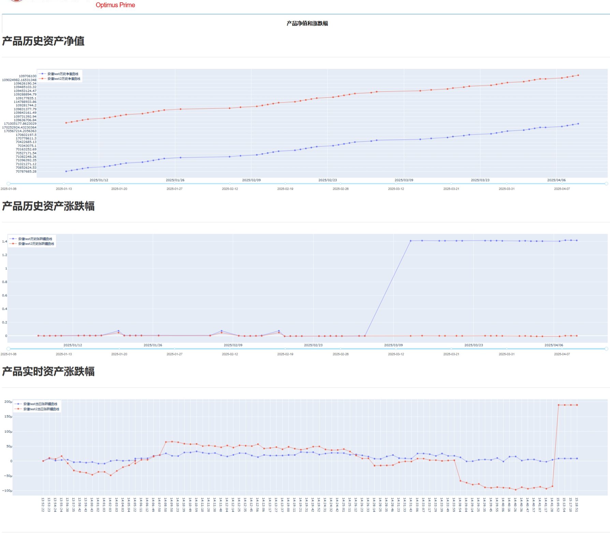
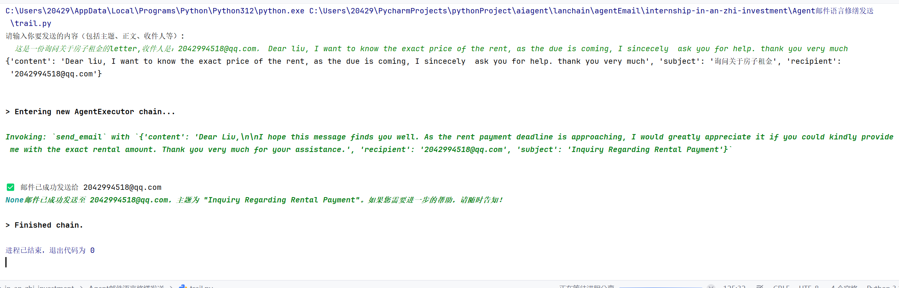
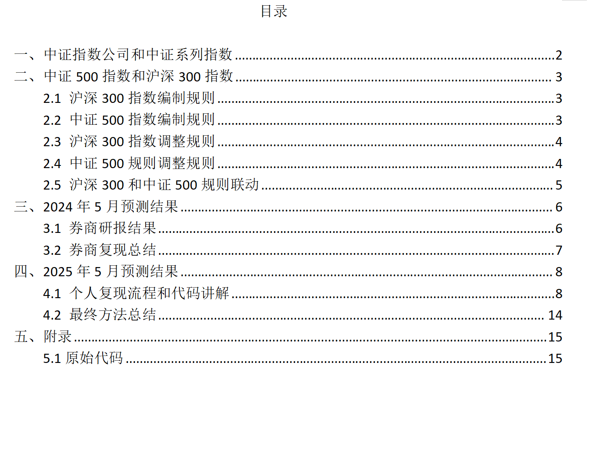
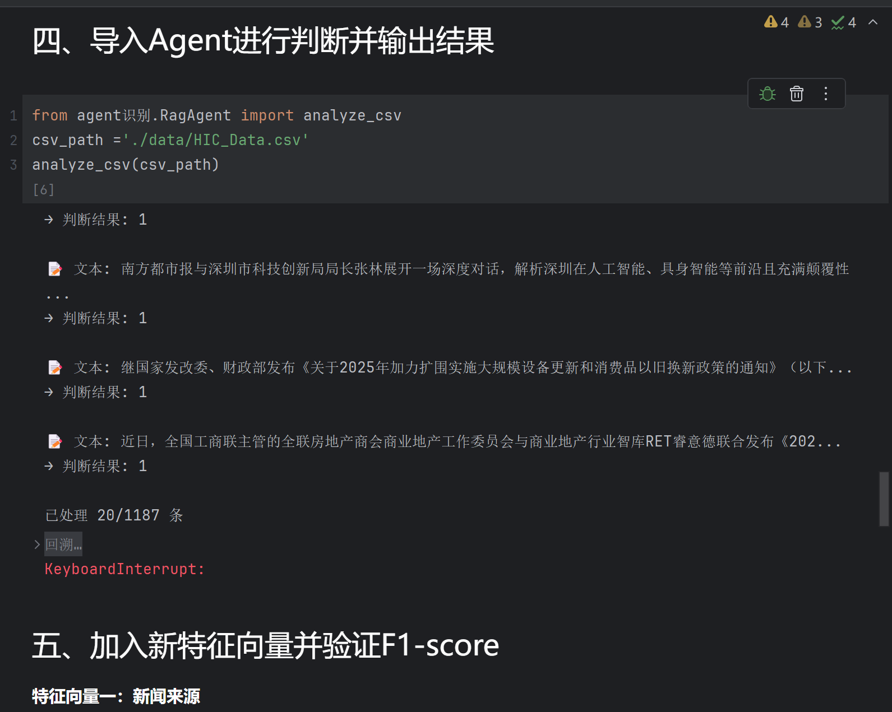

# Portfolio

## Overview  
This portfolio presents a comprehensive summary of all my featured projects.  
Each project folder contains detailed documentation and relevant code examples.  
You will find the following works:

- **Real-time Asset Net Value Visualisation:**  
  A dynamic dashboard built with Dash, capable of fetching, storing, and caching financial data through multithreading. It supports real-time data updates and interactive display of asset net value curves.

- **AI Agent for Language Polishing and Email Automation (LangChain Framework):**  
  An intelligent agent designed to automatically refine sentence structures, improve phrasing, and send emails seamlessly, leveraging LangChain’s modular capabilities.

- **Order Flow CTA Futures Trend Quantitative Strategy:**  
  A high-frequency trading strategy developed using order flow and market depth data. The strategy employs asynchronous coroutines to minimise slippage and identify dominant market forces. It has been fully backtested on the 2023–2024 futures market.

- **Prediction of CSI Index Adjustment Lists:**  
  A data-driven approach to forecast index constituent changes in the China Securities Index (CSI), accompanied by a full analytical report and workflow documentation.

- **Relationship Between A-share Market Movements and News Sentiment:**  
  A comprehensive analysis using Logistic Regression, XGBoost, and an AI Agent to explore the correlation between market behaviour and sentiment extracted from financial news.

- **Visual Evidence and Demonstrations:**  
  Screenshots and running examples illustrating the functionality and performance of each project.

> **Note:**  
> This portfolio is intended solely for demonstrating the author’s technical capabilities in data analysis and algorithmic development.  
> The strategies and analyses presented here are for educational and illustrative purposes only; no responsibility is assumed for their practical application or outcomes.

---

## Selected Demonstrations

  

Project 1 — Real-time Loading and Updating Animation

  

Project 2 — AI Agent Execution Result

  

Project 4 — Report Directory Display

  

Project 5 — Agent-assisted Label Judgement

